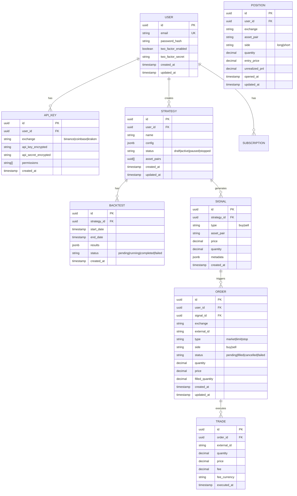

# Ejemplo: Arquitectura NeuralTrade Trading Platform

Este ejemplo demuestra cómo Nexus Architect analiza y diseña la arquitectura completa para una plataforma de trading.

---

## 📋 Solicitud del Usuario

> "Necesitamos diseñar el backend para NeuralTrade, una plataforma de trading algorítmico crypto. Los usuarios pueden crear estrategias, hacer backtesting y ejecutar trades automáticos."

---

## 1. 📋 Análisis de Requerimientos

### Contexto de Negocio
- **Tipo**: Fintech / Trading Platform
- **Usuarios objetivo**: 10k iniciales, proyectado 100k en 2 años
- **Geografía**: Global (multi-timezone)
- **Modelo de negocio**: Freemium + subscription

### Atributos de Calidad Clave

| Atributo | Requerimiento | Justificación |
|----------|---------------|---------------|
| **Disponibilidad** | 99.95% | Trading 24/7, pérdida de uptime = pérdida financiera |
| **Latencia** | <50ms para trades, <200ms para UI | Competitivo en crypto |
| **Escalabilidad** | 10k → 100k usuarios | Crecimiento proyectado |
| **Seguridad** | Nivel financiero | Manejo de credenciales de exchanges, datos sensibles |
| **Consistencia** | Fuerte para órdenes | No podemos perder ni duplicar trades |
| **Auditabilidad** | 100% de operaciones | Compliance y debugging |

### Bounded Contexts Identificados

```
┌─────────────────────────────────────────────────────────────────────────┐
│                         NEURALTRADE DOMAIN MAP                           │
├─────────────────────────────────────────────────────────────────────────┤
│                                                                         │
│  ┌──────────────────┐  ┌──────────────────┐  ┌──────────────────┐       │
│  │   IDENTITY       │  │   TRADING        │  │   STRATEGY       │       │
│  │   CONTEXT        │  │   CONTEXT        │  │   CONTEXT        │       │
│  │                  │  │                  │  │                  │       │
│  │  • User          │  │  • Order         │  │  • Strategy      │       │
│  │  • Auth          │  │  • Position      │  │  • Backtest      │       │
│  │  • API Keys      │  │  • Trade         │  │  • Signals       │       │
│  │  • Subscription  │  │  • Balance       │  │  • Indicators    │       │
│  └──────────────────┘  └──────────────────┘  └──────────────────┘       │
│                                                                         │
│  ┌──────────────────┐  ┌──────────────────┐  ┌──────────────────┐       │
│  │   MARKET DATA    │  │   NOTIFICATION   │  │   ANALYTICS      │       │
│  │   CONTEXT        │  │   CONTEXT        │  │   CONTEXT        │       │
│  │                  │  │                  │  │                  │       │
│  │  • Price Feed    │  │  • Alerts        │  │  • Performance   │       │
│  │  • OHLCV         │  │  • Webhooks      │  │  • Reports       │       │
│  │  • Order Book    │  │  • Email/Push    │  │  • Dashboards    │       │
│  └──────────────────┘  └──────────────────┘  └──────────────────┘       │
│                                                                         │
└─────────────────────────────────────────────────────────────────────────┘
```

---

## 2. 🛠️ Propuesta de Stack Tecnológico

### Frontend
```yaml
Framework: Next.js 14 (App Router)
  Razón: 
    - SSR para SEO en landing pages
    - RSC para reducir bundle size
    - Ecosystem maduro
    - El equipo tiene experiencia en React

State Management: Zustand + TanStack Query
  Razón:
    - Zustand: Estado local simple, sin boilerplate
    - TanStack Query: Cache + sync de server state
    - Evitamos Redux overkill

Styling: Tailwind CSS + shadcn/ui
  Razón:
    - Velocidad de desarrollo alta
    - Componentes accesibles pre-construidos
    - Fácil customización

Charts: TradingView Lightweight Charts
  Razón:
    - Estándar de la industria
    - Performance optimizado para real-time
    - Familiar para traders
```

### Backend - Arquitectura de Servicios
```yaml
Patrón: Monolito Modular → Microservicios (fase 2)
  Razón:
    - Fase 1: Velocidad de desarrollo con monolito
    - Fase 2: Extraer servicios que escalen independiente
    - Evitamos complejidad prematura de microservicios

Lenguajes:
  Core Services: TypeScript (Node.js)
    Razón: Mismo lenguaje front/back, async nativo, ecosistema
  
  ML Engine: Python (FastAPI)
    Razón: Librerías ML (pandas, numpy), mejor rendimiento numérico
  
  High-Performance (futuro): Go
    Razón: Para matching engine o hot paths si TypeScript no escala

Frameworks:
  - Fastify (Node.js): Performance superior a Express, schemas nativos
  - FastAPI (Python): Async, tipado, OpenAPI automático

Comunicación:
  Síncrona: REST (público) + gRPC (interno)
  Asíncrona: Redis Streams (Fase 1) → Kafka (Fase 2)
  Real-time: WebSocket (Socket.io para compatibilidad)
```

### Persistencia
```yaml
Base de Datos Principal: PostgreSQL 15
  Razón:
    - ACID para transacciones financieras
    - JSONB para datos flexibles (estrategias)
    - Extensiones: TimescaleDB para time-series

Time-Series Data: TimescaleDB (extensión PostgreSQL)
  Razón:
    - Mismo stack operacional que PostgreSQL
    - Optimizado para OHLCV y ticks
    - Compresión nativa

Cache Layer: Redis 7
  Razón:
    - Session storage
    - Rate limiting
    - Order book en memoria
    - Pub/Sub para real-time

Search (Fase 2): Meilisearch
  Razón:
    - Búsqueda de estrategias, assets
    - Más simple que Elasticsearch
    - Self-hostable, económico
```

### Infraestructura
```yaml
Container Orchestration: Docker Compose (Fase 1) → Kubernetes (Fase 2)
  Razón:
    - Fase 1: Simplicidad, un servidor puede manejar la carga
    - Fase 2: K8s cuando necesitemos auto-scaling

Hosting:
  Opción A (Budget): Railway / Render
    - Costo: ~$50-200/mes
    - Simplicidad máxima
  
  Opción B (Scale): AWS ECS / GCP Cloud Run
    - Costo: ~$300-1000/mes
    - Más control, mejor para Fase 2

CDN: Cloudflare
  Razón: 
    - Gratis para tier básico
    - DDoS protection incluido
    - Edge caching

Secrets Management: Doppler / AWS Secrets Manager
  Razón:
    - API keys de exchanges son críticas
    - Rotación automática
    - Audit log
```

---

## 3. 📐 Diseño de API y Datos

### API Endpoints Principales

```
┌────────────────────────────────────────────────────────────────────────┐
│  AUTHENTICATION                                                        │
├────────────────────────────────────────────────────────────────────────┤
│  POST   /auth/register          │ Crear cuenta                        │
│  POST   /auth/login             │ Login (email + password)            │
│  POST   /auth/refresh           │ Refresh access token                │
│  POST   /auth/logout            │ Invalidar refresh token             │
│  POST   /auth/2fa/enable        │ Habilitar 2FA                       │
│  POST   /auth/2fa/verify        │ Verificar código 2FA                │
├────────────────────────────────────────────────────────────────────────┤
│  USER MANAGEMENT                                                       │
├────────────────────────────────────────────────────────────────────────┤
│  GET    /users/me               │ Perfil del usuario autenticado      │
│  PATCH  /users/me               │ Actualizar perfil                   │
│  GET    /users/me/api-keys      │ Listar API keys de exchanges        │
│  POST   /users/me/api-keys      │ Agregar API key (encriptada)        │
│  DELETE /users/me/api-keys/:id  │ Eliminar API key                    │
├────────────────────────────────────────────────────────────────────────┤
│  STRATEGIES                                                            │
├────────────────────────────────────────────────────────────────────────┤
│  GET    /strategies             │ Listar estrategias del usuario      │
│  POST   /strategies             │ Crear nueva estrategia              │
│  GET    /strategies/:id         │ Detalle de estrategia               │
│  PATCH  /strategies/:id         │ Actualizar estrategia               │
│  DELETE /strategies/:id         │ Eliminar estrategia                 │
│  POST   /strategies/:id/backtest│ Ejecutar backtest                   │
│  POST   /strategies/:id/deploy  │ Activar trading en vivo             │
│  POST   /strategies/:id/stop    │ Detener trading                     │
├────────────────────────────────────────────────────────────────────────┤
│  TRADING                                                               │
├────────────────────────────────────────────────────────────────────────┤
│  GET    /positions              │ Posiciones abiertas                 │
│  GET    /orders                 │ Historial de órdenes                │
│  GET    /trades                 │ Historial de trades                 │
│  GET    /balances               │ Balances por exchange               │
├────────────────────────────────────────────────────────────────────────┤
│  MARKET DATA (WebSocket)                                               │
├────────────────────────────────────────────────────────────────────────┤
│  WS     /ws/prices              │ Stream de precios real-time         │
│  WS     /ws/trades              │ Stream de trades del usuario        │
└────────────────────────────────────────────────────────────────────────┘
```

### Esquema de Base de Datos



### Time-Series Schema (TimescaleDB)

```sql
-- Tabla de precios OHLCV (hypertable)
CREATE TABLE market_ohlcv (
    time        TIMESTAMPTZ NOT NULL,
    exchange    TEXT NOT NULL,
    symbol      TEXT NOT NULL,
    interval    TEXT NOT NULL,  -- '1m', '5m', '1h', '1d'
    open        DECIMAL(20, 8),
    high        DECIMAL(20, 8),
    low         DECIMAL(20, 8),
    close       DECIMAL(20, 8),
    volume      DECIMAL(20, 8),
    PRIMARY KEY (time, exchange, symbol, interval)
);

-- Convertir a hypertable para optimización time-series
SELECT create_hypertable('market_ohlcv', 'time');

-- Compresión automática para datos antiguos
ALTER TABLE market_ohlcv SET (
    timescaledb.compress,
    timescaledb.compress_segmentby = 'exchange, symbol, interval'
);

SELECT add_compression_policy('market_ohlcv', INTERVAL '7 days');
```

---

## 4. 🔐 Consideraciones de Seguridad

### Autenticación

```yaml
Método: JWT (RS256) + Refresh Tokens + 2FA obligatorio para trading

Access Token:
  TTL: 15 minutos
  Payload: { userId, email, role, permissions }
  Almacenamiento: Memoria (no localStorage)

Refresh Token:
  TTL: 7 días
  Almacenamiento: httpOnly cookie + base de datos
  Rotación: En cada refresh
  Revocación: Inmediata en logout

2FA:
  Método: TOTP (Google Authenticator compatible)
  Obligatorio: Para activar estrategias y ver API keys
  Backup codes: 10 códigos de un solo uso
```

### Encriptación de API Keys

```typescript
/**
 * Las API keys de exchanges son ultra-sensibles.
 * Se encriptan con AES-256-GCM antes de almacenar.
 * La clave de encriptación está en secrets manager, no en código.
 */
import { createCipheriv, createDecipheriv, randomBytes } from 'crypto';

const ALGORITHM = 'aes-256-gcm';

export function encryptApiKey(plaintext: string, masterKey: Buffer): EncryptedData {
  const iv = randomBytes(16);
  const cipher = createCipheriv(ALGORITHM, masterKey, iv);
  
  let encrypted = cipher.update(plaintext, 'utf8', 'hex');
  encrypted += cipher.final('hex');
  
  const authTag = cipher.getAuthTag();
  
  return {
    iv: iv.toString('hex'),
    encrypted,
    authTag: authTag.toString('hex'),
  };
}

export function decryptApiKey(data: EncryptedData, masterKey: Buffer): string {
  const decipher = createDecipheriv(
    ALGORITHM,
    masterKey,
    Buffer.from(data.iv, 'hex')
  );
  
  decipher.setAuthTag(Buffer.from(data.authTag, 'hex'));
  
  let decrypted = decipher.update(data.encrypted, 'hex', 'utf8');
  decrypted += decipher.final('utf8');
  
  return decrypted;
}
```

### Rate Limiting

```yaml
Endpoints Públicos:
  - /auth/*: 10 req/min por IP
  - Razón: Prevenir brute force

Endpoints Autenticados:
  - General: 100 req/min por usuario
  - /strategies/*/backtest: 5 req/min (CPU intensivo)
  - /orders: 30 req/min (límite de exchanges)

WebSocket:
  - Conexiones: 3 por usuario
  - Mensajes: 50/seg (prevenir flood)

Implementación: Redis-based sliding window
```

### Audit Logging

```typescript
/**
 * Todas las operaciones sensibles se loguean para compliance.
 * Los logs se envían a un servicio separado (inmutable).
 */
interface AuditEvent {
  timestamp: Date;
  userId: string;
  action: 'login' | 'api_key_created' | 'strategy_deployed' | 'order_placed';
  resource: string;
  ip: string;
  userAgent: string;
  metadata: Record<string, unknown>;
  outcome: 'success' | 'failure';
}

// Ejemplo de uso
await auditLog.record({
  action: 'api_key_created',
  resource: `api_key:${apiKeyId}`,
  metadata: { exchange: 'binance', permissions: ['read'] },
  outcome: 'success',
});
```

---

## 5. ⚖️ Trade-offs

### Decisiones Arquitectónicas

| Decisión | Ganamos | Sacrificamos | Mitigación |
|----------|---------|--------------|------------|
| **Monolito Modular (Fase 1)** | Velocidad de desarrollo, deployment simple | Escalado granular | Diseñar módulos con boundaries claros para extraer después |
| **PostgreSQL para todo** | Un solo sistema a operar, ACID garantizado | Optimización específica por tipo de dato | TimescaleDB para time-series, Redis para cache |
| **TypeScript en backend** | Fullstack JS, contratación fácil | Performance vs Go/Rust | Optimizar hot paths, extraer a Go si es necesario |
| **Redis Streams vs Kafka** | Simplicidad, ya usamos Redis | Throughput masivo, replay histórico | Migrar a Kafka en Fase 2 si superamos 50k msg/seg |
| **JWT stateless** | Escalabilidad horizontal | No revocación inmediata | Refresh token blacklist en Redis, TTL corto |

### Riesgos y Mitigaciones

```
┌─────────────────────────────────────────────────────────────────────────┐
│  RIESGO                          │ PROBABILIDAD │ IMPACTO │ MITIGACIÓN  │
├─────────────────────────────────────────────────────────────────────────┤
│  Exchange API rate limits        │ Alta         │ Medio   │ Queue con   │
│  nos bloquean                    │              │         │ backoff     │
├─────────────────────────────────────────────────────────────────────────┤
│  Pérdida de datos de mercado     │ Media        │ Alto    │ Múltiples   │
│  por downtime de proveedor       │              │         │ fuentes     │
├─────────────────────────────────────────────────────────────────────────┤
│  Fallo en ejecución de trade     │ Baja         │ Crítico │ Circuit     │
│  durante volatilidad             │              │         │ breaker, 2x │
│                                  │              │         │ confirmación│
├─────────────────────────────────────────────────────────────────────────┤
│  Breach de API keys              │ Baja         │ Crítico │ Encriptación│
│                                  │              │         │ AES-256, no │
│                                  │              │         │ withdrawal  │
│                                  │              │         │ permissions │
└─────────────────────────────────────────────────────────────────────────┘
```

---

## 6. 📊 Diagrama de Arquitectura Final

```mermaid
graph TB
    subgraph "Clients"
        WEB[Web App<br/>Next.js]
        MOBILE[Mobile<br/>React Native]
    end
    
    subgraph "Edge"
        CF[Cloudflare<br/>CDN + WAF]
    end
    
    subgraph "API Layer"
        GW[API Gateway<br/>Rate Limiting]
        WS[WebSocket<br/>Server]
    end
    
    subgraph "Core Services"
        AUTH[Auth<br/>Service]
        STRATEGY[Strategy<br/>Service]
        TRADING[Trading<br/>Service]
        MARKET[Market Data<br/>Service]
    end
    
    subgraph "Background"
        BACKTEST[Backtest<br/>Worker]
        SIGNAL[Signal<br/>Processor]
        EXECUTOR[Order<br/>Executor]
    end
    
    subgraph "ML"
        ML[ML Engine<br/>Python/FastAPI]
    end
    
    subgraph "Data Layer"
        PG[(PostgreSQL<br/>+ TimescaleDB)]
        REDIS[(Redis<br/>Cache + Pub/Sub)]
    end
    
    subgraph "External"
        BINANCE[Binance API]
        COINBASE[Coinbase API]
        KRAKEN[Kraken API]
    end
    
    WEB --> CF
    MOBILE --> CF
    CF --> GW
    CF --> WS
    
    GW --> AUTH
    GW --> STRATEGY
    GW --> TRADING
    GW --> MARKET
    
    WS --> REDIS
    
    STRATEGY --> PG
    STRATEGY --> REDIS
    AUTH --> PG
    AUTH --> REDIS
    TRADING --> PG
    MARKET --> PG
    
    STRATEGY --> BACKTEST
    BACKTEST --> ML
    ML --> PG
    
    TRADING --> SIGNAL
    SIGNAL --> EXECUTOR
    EXECUTOR --> BINANCE
    EXECUTOR --> COINBASE
    EXECUTOR --> KRAKEN
    
    MARKET --> BINANCE
    MARKET --> COINBASE
    MARKET --> KRAKEN
```

---

## 7. 💰 Estimación de Costos

### Fase 1 (0-10k usuarios)
```yaml
Infraestructura:
  - Railway/Render: $100/mes (2 services + database)
  - Redis Cloud: $0 (free tier, 30MB)
  - Cloudflare: $0 (free tier)
  - Doppler (secrets): $0 (free tier)
  
Total: ~$100-150/mes
```

### Fase 2 (10k-100k usuarios)
```yaml
Infraestructura:
  - AWS ECS o GCP Cloud Run: $400/mes
  - RDS PostgreSQL: $150/mes
  - ElastiCache Redis: $100/mes
  - Cloudflare Pro: $20/mes
  - Datadog (observability): $100/mes
  
Total: ~$800-1000/mes
```

---

## ✅ Checklist de Revisión

- [x] Atributos de calidad definidos
- [x] Stack tecnológico justificado
- [x] API endpoints documentados
- [x] Esquema de base de datos completo
- [x] Seguridad: auth, encryption, rate limiting
- [x] Trade-offs explícitos
- [x] Diagrama de arquitectura
- [x] Estimación de costos
- [x] Riesgos identificados con mitigaciones

---

*Este ejemplo demuestra la metodología completa de Nexus Architect aplicada al proyecto NeuralTrade.*
